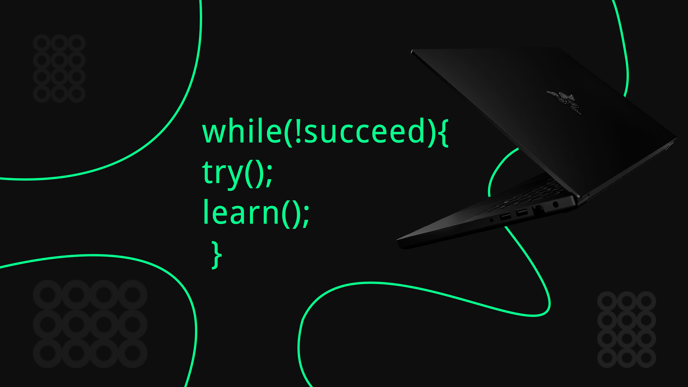

<h1>Hello world </h1>

<a href="https://discord.gg/4QEKhWr">
  
  &nbsp;
</a>
<a href="https://twitter.com/Sid_1_">
  
  &nbsp;
</a>
<a href="https://linkedin.com/in/siddharth-shukla-63b29b1b5">
  
  &nbsp;
</a>

---

**Hey there , my name is Siddharth and I am a web programmer. At present I am pursuing my bachelors in Physics.**

<!--  -->

---

 

**ABOUT ME**

- I am studying more about Decentralised Finance and Web3.
- I’m currently proficient as a  Web Developer.
- I am also an active Investor and love Music and Film production.
- My contact : [My twitter handle ](https://twitter.com/Sid_1_);
- 📝[My resume](https://drive.google.com/file/d/1qphGnoEWL4nyXjfNtHiXFgcYt3fkMEcO/view?usp=sharing)

  

---

= = = My Tech Stack = = =    
<code> </code>
<code></code>
<code></code>
<code></code>
<code></code>
<code></code>
<code></code>

 

---

---

